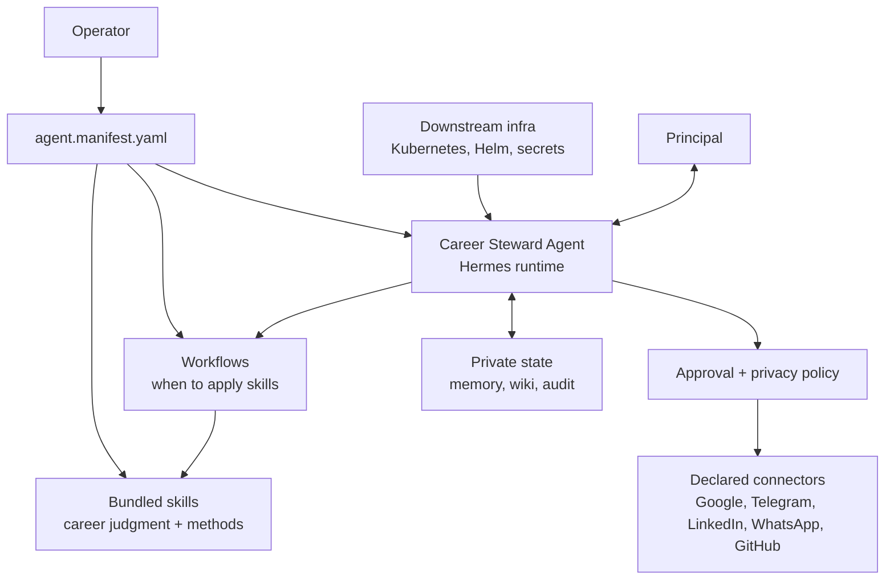

# Career Steward Agent

Declarative specification and reference implementation for approval-gated career-steward agents.

## What & Why

This repository defines a reusable career-steward agent from source declarations: identity, runtime, bundled skills, connectors, workflows, schedules, secrets, policy, state, observability, and tests. Operators bring their own credentials by reference; no private source-operator data or hidden setup belongs in the repo.

The repo is a specification and build source, not a live deployment. CI proves the spec, sim mode, and generated artifacts; downstream infrastructure decides whether to run the produced OCI image and Helm chart.

## Quickstart

```bash
git clone https://github.com/selamy-labs/career-steward-agent.git
cd career-steward-agent
python3 -m pip install pyyaml
make verify
```

Expected result:

```text
validation.status: ok
container structure tests ok
unit tests pass
touchedRealAccounts: false
externalSideEffects: []
```

## Requirements

- Python 3.11+
- `make`
- PyYAML

Sim mode uses fake fixtures only. Real accounts require declared secret references in `contracts/required-secrets.yaml`; secret values must never be committed.

## Usage

`agent.manifest.yaml` is the source of truth. Edit it to instantiate a new agent identity, then verify:

```bash
make verify
make sim
```

The sim walkthrough in `docs/instantiate-new-person-sim.md` proves one full loop:

```text
intake -> classify -> draft -> approval gate -> pipeline update -> privacy validation
```

## Architecture



The repo defines the agent contract and reference image; a downstream infra repo decides whether to run it. At runtime, the agent acts for a principal, loads bundled skills for career-steward judgment, uses declared connectors for credentialed calls, writes declared private state, and gates outbound or state-mutating actions through approval and privacy policy.

See `docs/architecture.md` for context and container views.

## Configuration

- Manifest schema: `schemas/agent.manifest.schema.json`
- Architecture: `docs/architecture.md`
- Reconciler contract: `docs/reconciler-contract.md`
- Policy engine: `docs/policy-engine-spec.md`
- Observability: `docs/observability-contract.md`
- State and migration: `docs/state-memory-migration.md`
- Capability parity: `docs/capability-parity-inventory.md`
- Distribution ADR: `docs/adr-001-vessel-and-distribution.md`

## Development

```bash
make test
make container-structure
make verify
make image-structure
python3 scripts/scan_private_markers.py
```

`make verify` runs schema/contract validation, container structure tests, policy tests, write-boundary tests, and a no-real-accounts sim smoke test.

`make image-structure` builds `image/Containerfile` and applies the same structure spec to the real image. It uses a Docker-compatible runtime by default; on macOS, Colima provides an open-source-friendly local runtime. Use `CONTAINER_RUNTIME=podman make image-structure` when Podman is available.

## Contributing

Changes must keep `agent.manifest.yaml` as the single source of truth. PRs must pass CI, preserve approval gates and privacy validation, and avoid committed credentials, private tracker data, or environment-specific deployment state.

## License

Apache-2.0. See `LICENSE`.
