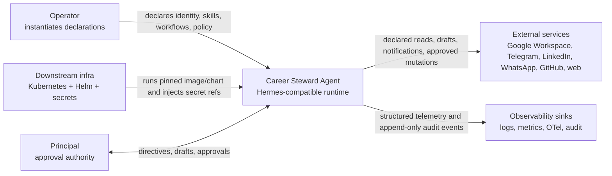
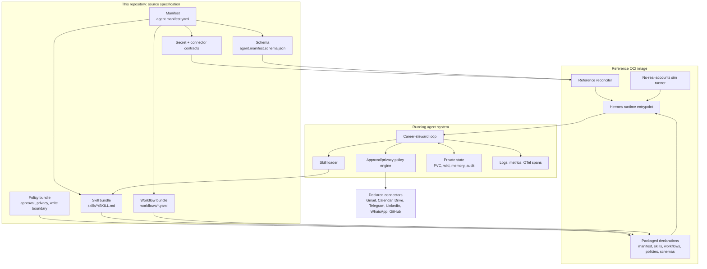

# Architecture

This document describes the reusable career-steward agent system, not just the build process. The repository is the source specification. The produced image and Helm chart are delivery artifacts that a downstream infrastructure repo may choose to run.

The diagram-freshness baseline is the minimal
[`System Context`](architecture/system-context.md) under `docs/architecture/`.
This document adds the detailed container and behavioral views.

## What We Built

- A declarative agent contract centered on `agent.manifest.yaml`.
- A bundled skill layer in `skills/*/SKILL.md` that teaches career-steward methods.
- Declarative workflows that decide when those skills apply.
- Connector contracts for credentialed external systems.
- Non-removable approval, privacy, write-boundary, observability, and audit contracts.
- A Hermes-compatible reference image that packages the manifest, skills, workflows, policies, schemas, reconciler, sim runner, and fake fixtures without real credentials or private state.

## System Context

## Container View

## Ability Derivation

The agent derives its abilities through four explicit layers:

1. `agent.manifest.yaml` authorizes toolsets, connector surfaces, skill refs, workflows, schedules, state, and policy.
2. `skills/*/SKILL.md` provides worker-readable career-steward methods such as opportunity triage, interview prep, approval-gated correspondence, public-content safety, private-message digesting, and state maintenance.
3. `workflows/*.yaml` binds those methods to recurring jobs and state models.
4. Connectors and tools perform credentialed reads/writes only when the declared policy allows them.

Skills are knowledge and procedure the agent reads. Connectors are callable capabilities with credentials and structured I/O. An external API operation should be a connector/tool, not prose hidden in a skill.

## Side-Effect Boundary

The runtime may freely read bundled declarations and fake sim fixtures. It may write only declared private state under `/opt/data/**`. Every outbound or state-mutating action is evaluated by the policy engine for exact-text approval, expiry, escalation, forbidden actions, and privacy/public-safety validation before execution.
