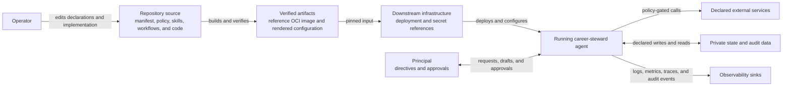

# System Context

This repository is the source specification and reference implementation for a
career-steward agent. It does not deploy or operate a live agent. Downstream
infrastructure chooses whether to deploy the verified artifacts and supplies
credentials by reference.

The repository boundary ends at the verified artifacts. Runtime side effects
are constrained by the declared approval, privacy, and write-boundary policies;
the no-real-accounts simulator exercises that boundary without live services.

See [`../architecture.md`](../architecture.md) for the container view and the
derivation of runtime abilities.
